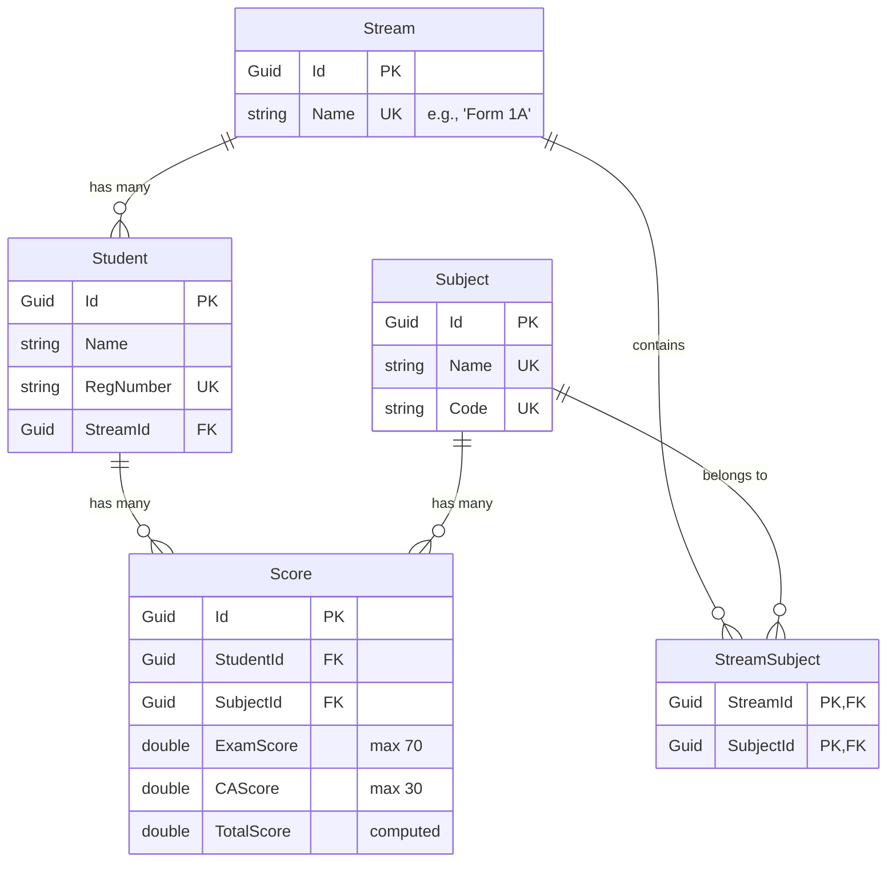

# Ikonex Academy Student Management System - Backend Documentation

This document provides a comprehensive technical overview of the Ikonex Academy Student Management System backend. The system is built using **.NET 9 (ASP.NET Core Web API)** and **Entity Framework Core** targeting a **PostgreSQL** database.

---

## 1. Architectural Design

The backend follows a clean, single-project monolithic architecture structured to decouple concerns and enforce stability:

```text
IKONEX-Academy/
├── Data/                 # Database Context & Schema Configurations
├── Entities/             # Entity Framework Core Domain Models
├── DTOs/                 # Data Transfer Objects for Ingress/Egress Payloads
├── Controllers/          # RESTful Endpoints & Request/Response Handlers
├── Middleware/           # Global Request Pipeline Filters (Exception Handling)
└── Program.cs            # Entry point & Dependency Injection Registrations
```

### Core Architecture Principles:
* **Separation of Concerns (DTOs)**: Controllers accept and return Data Transfer Objects (DTOs) rather than raw EF database entities. This prevents over-posting attacks, resolves JSON serialization circular loops, and insulates the client API contracts from database schema modifications.
* **Global Error Interception**: A custom middleware intercepts all unhandled runtime exceptions globally, logging them and returning a standard error schema to the client.
* **Global CORS Setup**: An open CORS policy accommodates containerized frontend clients on different domains or ports during development and deployment.

---

## 2. Database Schema & Data Integrity

The relational database schema is configured in the `IkonexDbContext` using Fluent API.

### Entity Relationships



### Mandatory Database Constraints:
1. **Unique Indices**:
   * `Stream.Name` (Unique, case-insensitive check at logic level).
   * `Student.RegNumber` (Unique).
   * `Subject.Name` and `Subject.Code` (Unique).
2. **Score Submissions Uniqueness**: A unique composite index is configured across `Score.[StudentId, SubjectId]`. This enforces at the database level that a student can only have one score entry per subject.

---

## 3. API Endpoints

The API is fully RESTful and processes requests asynchronously (`Task<IActionResult>`).

### A. Stream Management
* `POST /api/streams` - Create a stream (enforces name uniqueness).
* `GET /api/streams` - View all streams.
* `GET /api/streams/{id}` - View single stream details (including its assigned students and subjects).

### B. Student Management
* `POST /api/students` - Register a student and assign them to an existing stream (checks stream existence and enforces registration number uniqueness).
* `PUT /api/students/{id}` - Edit student details.
* `DELETE /api/students/{id}` - Delete student information.
* `GET /api/students/{id}` - View single student details (including their entire score card).
* `GET /api/students` - View all students.
* `GET /api/students/stream/{streamId}` - View all students belonging to a specific stream.

### C. Subject Management
* `POST /api/subjects` - Create a subject (enforces name/code uniqueness).
* `GET /api/subjects` - View all subjects.
* `PUT /api/subjects/{id}` - Edit subject details.
* `DELETE /api/subjects/{id}` - Delete subject.
* `POST /api/streams/{streamId}/subjects/{subjectId}` - Assign a subject to a specific stream.
* `DELETE /api/streams/{streamId}/subjects/{subjectId}` - Unassign a subject from a stream.

### D. Assessment & Scoring Engine
* `POST /api/scores` - Record a student score.
  * *Validation*: Computes `TotalScore = ExamScore + CAScore`. Validates that `ExamScore <= 70` and `CAScore <= 30`. Rejects request with `400 BadRequest ("Duplicate score submission prohibited")` if a score entry already exists for that student and subject.
* `PUT /api/scores/{id}` - Edit and update an existing score card (recalculates `TotalScore` and enforces the same limits).

---

## 4. Advanced Math Engine & Leaderboard Rankings

The endpoint `GET /api/reports/stream/{streamId}` computes and returns a completely processed leaderboard for a class stream. It executes the following mathematical operations in memory after querying the database:

### 1. Individual Statistics Calculations
For each student in the stream:
* **`TotalMarks`**: The sum of all `TotalScore` values for subjects assigned to that stream:
  $$\text{TotalMarks} = \sum \text{TotalScore}_{\text{stream subjects}}$$
* **`AverageScore`**: TotalMarks divided by the number of subjects associated with that stream:
  $$\text{AverageScore} = \frac{\text{TotalMarks}}{\text{Count(Subjects in Stream)}}$$
  *(If the stream has no subjects, the average defaults to `0.0` to prevent division by zero).*
* **`Grade`**: Determined based on this scale:
  * $\text{Average} \ge 80 \implies \text{'A'}$
  * $\text{Average} \ge 70 \implies \text{'B'}$
  * $\text{Average} \ge 60 \implies \text{'C'}$
  * $\text{Average} \ge 50 \implies \text{'D'}$
  * $\text{Average} < 50 \implies \text{'E'}$

### 2. Standard Competition Ranking (1224 Rule)
Ties are handled using Standard Competition Ranking (also known as "minimum ranking"). If multiple items tie for a position, they share the same rank, and a gap is left in the ranking sequence.

For example, if student scores are `[90, 90, 85, 80]`:
* Student A (90) $\implies$ **1st**
* Student B (90) $\implies$ **1st**
* Student C (85) $\implies$ **3rd** (Rank 2 is skipped)
* Student D (80) $\implies$ **4th**

This ranking engine is applied in two scopes:
* **Subject Positions**: Rank of each student in the stream for each individual subject.
* **Overall Class Position**: Rank of each student in the stream based on overall `TotalMarks`.

---

## 5. Infrastructure & Security

### Global Exception Handling Middleware
An unhandled exception filter catch-all sits first in the request pipeline. If a service or controller throws an error, it is logged, and a standardized JSON payload is returned to the client:
```json
{
  "error": "Error description message",
  "statusCode": 500
}
```

### Global CORS Policy
Configured in `Program.cs` to allow requests from any origin, header, and HTTP method. This permits local React frontends or containerized production services to communicate with the Web API seamlessly.

---

## 6. How to Run Locally

### Prerequisites
* .NET 9 SDK
* PostgreSQL database instance running locally or remotely

### Steps
1. **Configure Connection**: Edit the connection string in `appsettings.json`:
   ```json
   "ConnectionStrings": {
     "DefaultConnection": "Host=localhost;Database=IkonexAcademyDb;Username=postgres;Password=yourpassword"
   }
   ```
2. **Apply Migrations**: Run the following commands in the CLI to generate schemas in PostgreSQL:
   ```bash
   dotnet ef migrations add InitialCreate
   dotnet ef database update
   ```
3. **Start the API**:
   ```bash
   dotnet run
   ```
   The API will listen on `http://localhost:5000` (or the configured `launchSettings.json` profiles) and serve the OpenAPI spec at `/openapi/v1.json`.
